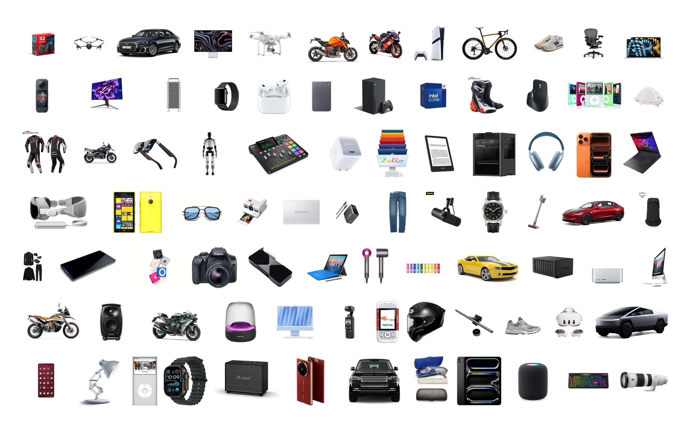
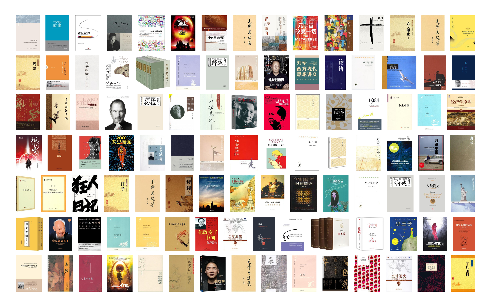
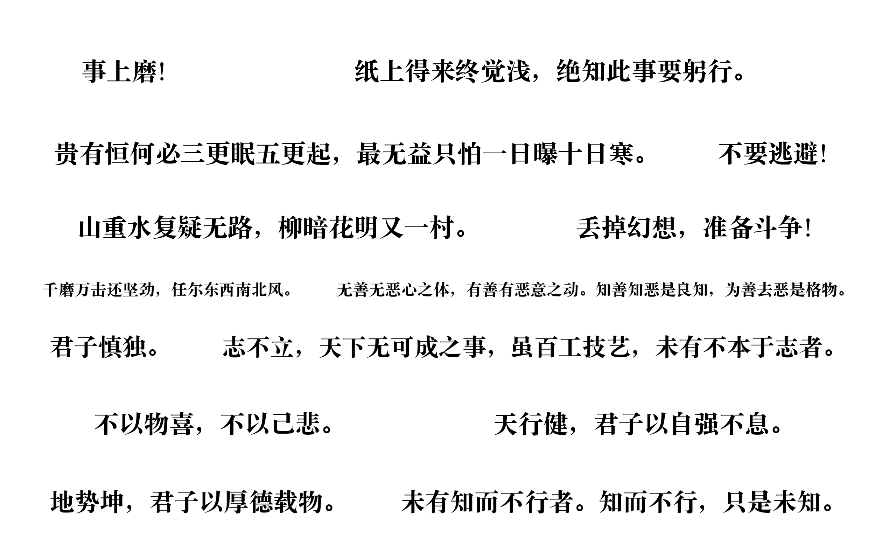
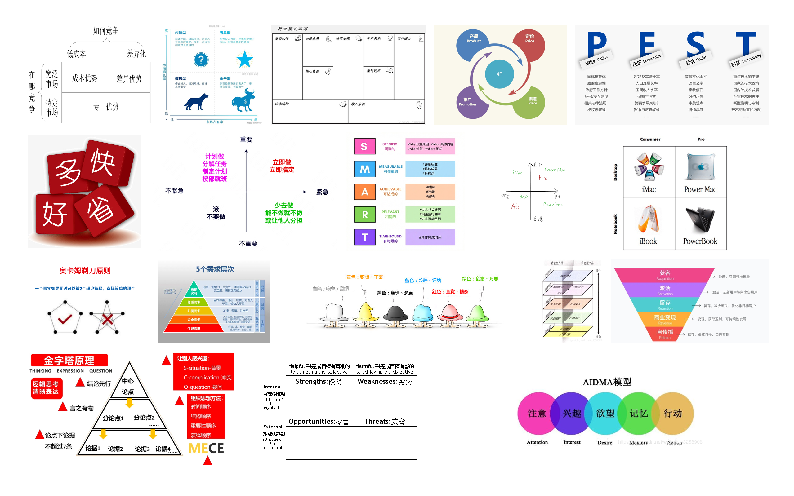
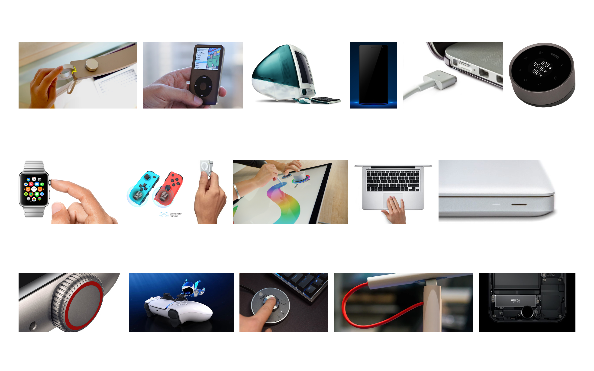
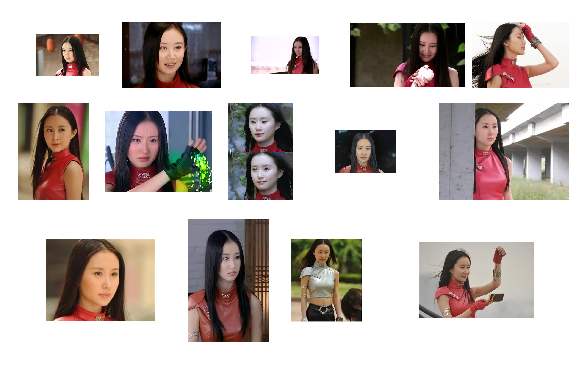

# beatiful world!

支持 SVG/PNG/JPEG/WebP/AVIF 批量生成图片墙










## 快速开始

```bash
python3 -m venv .venv
source .venv/bin/activate
pip install -r requirements.txt
python app.py
```

打开 [http://127.0.0.1:5001](http://127.0.0.1:5001)
